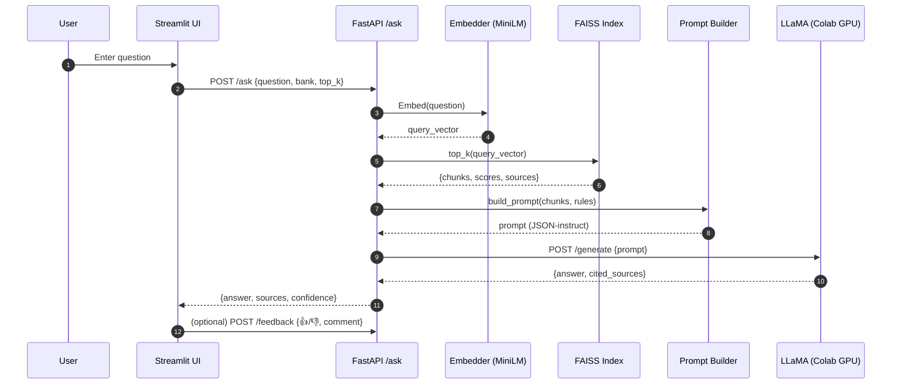
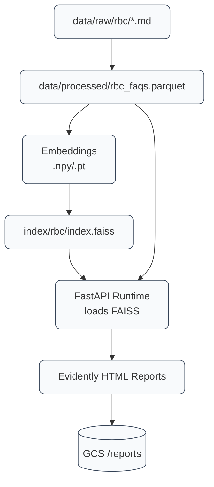

---

````markdown
# 🧠 RAG Project  
*A Retrieval-Augmented Generation (RAG) System for Canadian Banking FAQs — starting with RBC*  


---

## 📘 Project Overview

This project implements an **end-to-end Retrieval-Augmented Generation (RAG)** pipeline for **Canadian banking FAQs**, beginning with Royal Bank of Canada (RBC).  
It integrates a **FastAPI backend**, **semantic retrieval (FAISS)**, and **instruction-tuned LLMs (Phi-3 Mini or LLaMA 3.1)** to deliver grounded, explainable answers.

The system prevents **hallucinations** by grounding responses strictly in retrieved FAQ context — replying *“I don’t know.”* when an answer is unavailable.  

---

## 🎯 Project Goals
- Build a modular, scalable RAG system that can extend to other Canadian banks.  
- Guarantee accuracy and factual grounding.  
- Demonstrate real-world MLOps: monitoring, CI/CD, and cloud deployment.  
- Support GPU-based (LLaMA) and CPU-based (Phi-3 Mini) inference options.  

---

## 🧠 Model Selection

By default, the system runs **Phi-3 Mini (fast for CPU)**.  
To use **LLaMA 3.1 (8B, high quality, GPU recommended)**:

```bash
make run-api MODEL=llama
````

To switch back:

```bash
make run-api MODEL=phi3
```

---

## 🧭 Architecture Diagram
---

### 1) System Architecture (RAG + Infra)

```mermaid
flowchart LR
  %% STYLE
  classDef svc fill:#e7f0ff,stroke:#3b82f6,stroke-width:1px,color:#111,rx:8,ry:8;
  classDef comp fill:#f1f5f9,stroke:#64748b,stroke-width:1px,color:#111,rx:8,ry:8;
  classDef data fill:#ecfeff,stroke:#06b6d4,stroke-width:1px,color:#111,rx:8,ry:8;
  classDef cloud fill:#eefce8,stroke:#16a34a,stroke-width:1px,color:#111,rx:8,ry:8;
  classDef monitor fill:#fff7ed,stroke:#f97316,stroke-width:1px,color:#111,rx:8,ry:8;

  %% CLIENT
  U[User<br/>Browser]:::comp --> UI[Streamlit UI<br/>(src/frontend/app.py)]:::svc

  %% BACKEND
  UI -->|HTTP /ask| API[FastAPI Backend<br/>(src/api/main.py)]:::svc

  subgraph RETRIEVAL["RAG Retrieval Layer"]
    Q[Query Embedder<br/>Sentence-Transformers<br/>(MiniLM-L6-v2)]:::comp
    VS[(FAISS Index<br/>/index/rbc)]:::data
    DS[(Processed Docs<br/>/data/processed/*.parquet)]:::data
    API --> Q
    Q --> VS
    VS -->|Top-k chunks + scores| PB[Prompt Builder<br/>(src/generation/prompts.py)]:::comp
    DS -. load/refresh .-> VS
  end

  %% GENERATION
  PB -->|JSON prompt| COLAB[LLM Inference (LLaMA Instruct)<br/>Google Colab GPU + Tunnel]:::svc
  COLAB -->|Answer JSON| API

  %% OUTPUT
  API --> UI
  UI -->|HTTP /feedback| FB[Feedback Logger<br/>(JSONL/GCS)]:::data

  %% MONITORING
  subgraph MON["Monitoring & Analytics"]
    EV[Evidently Reports<br/>(drift/quality)<br/>src/monitoring/evidently_report.py]:::monitor
    DASH[Feedback Dashboard<br/>Streamlit<br/>src/dashboard/feedback_dashboard.py]:::monitor
  end
  FB --> DASH
  VS --> EV
  EV --> GCS[(GCS Bucket<br/>gs://rag-banking.../reports)]:::cloud

  %% DEPLOYMENT
  subgraph CLOUD["Deployment (GCP)"]
    CR[Cloud Run<br/>FastAPI container]:::cloud
    AR[(Artifact Registry)]:::cloud
    SE[Secret Manager<br/>(COLAB URL/TOKEN)]:::cloud
    BKT[(GCS Bucket<br/>indexes, docs)]:::cloud
  end

  API -. docker image .-> AR
  AR --> CR
  SE --> CR
  BKT --> CR
  CR -->|Public HTTPS| UI

  %% AUTOMATION
  subgraph CI["Automation"]
    GH[GitHub Actions<br/>CI/CD]:::comp
    TF[Terraform IaC<br/>infra/terraform]:::comp
  end
  GH -->|build/test/push| AR
  GH -->|terraform apply| TF
  TF --> CLOUD
```

---

### 2) Request Sequence (Ask → Retrieve → Generate → Respond)



---

### 3) Data & Artifact Flow



---

## ⚙️ Tech Stack

| Category            | Tools                                      |
| ------------------- | ------------------------------------------ |
| **Language**        | Python 3.11                                |
| **Frameworks**      | FastAPI · Streamlit                        |
| **Vector Store**    | FAISS                                      |
| **Embeddings**      | Sentence-Transformers (`all-MiniLM-L6-v2`) |
| **LLM**             | LLaMA Instruct (served via Colab GPU)      |
| **Infrastructure**  | Docker · Terraform · GCP Cloud Run         |
| **Monitoring**      | Evidently AI                               |
| **Testing**         | Pytest                                     |
| **CI/CD**           | GitHub Actions                             |
| **Version Control** | Git + VS Code                              |

---

## 🗂️ Project Structure

```bash
├─ src/
│  ├─ api/          # FastAPI backend endpoints
│  ├─ frontend/     # Web Chat UI (HTML + Jinja2 Templates)
│  ├─ ingestion/    # RBC FAQ scraping scripts
│  ├─ preprocess/   # Cleaning and text chunking
│  ├─ embeddings/   # Embedding generation and FAISS index
│  ├─ generation/   # Prompt and LLM inference (Phi-3 / LLaMA)
│  ├─ retrieval/    # Search and ranking
│  ├─ monitoring/   # Drift and feedback monitoring
│  └─ tests/        # Unit and integration tests
│
├─ data/
│  ├─ raw/          # Scraped RBC pages
│  ├─ processed/    # Cleaned FAQ dataset
│  ├─ index/        # FAISS index and metadata
│  └─ reports/      # Data inspection reports
│
├─ logs/            # System and scraping logs
├─ infra/terraform/ # Infrastructure-as-Code
├─ Makefile         # Developer commands
├─ requirements.txt # Dependencies
└─ README.md
```

---

## 🚀 Quick Start

### 1️⃣ Clone and set up environment

```bash
git clone git@github.com:JDede1/rag-project.git
cd rag-project
python3 -m venv venv
source venv/bin/activate
make install
```

### 2️⃣ Run the backend

```bash
make run-api
```

Access docs → [http://127.0.0.1:8000/docs](http://127.0.0.1:8000/docs)

### 3️⃣ Run the web chat UI

```bash
make run-ui
```

Access the UI → [http://127.0.0.1:8500](http://127.0.0.1:8500)

---

## 🧪 Testing

Run all unit tests:

```bash
pytest -v
```

Includes:

* Embedding vector generation
* FAISS retrieval
* “I don’t know” fallback
* `/ask` & `/feedback` endpoint validation

---

## ☁️ Deployment

### Docker

```bash
docker build -t rag-banking .
docker run -p 8000:8000 rag-banking
```

### Terraform (IaC)

```bash
cd infra/terraform
terraform init
terraform apply -auto-approve
```

### GitHub Actions (CI/CD)

* Runs on every push:

  * ✅ Lint & test
  * 🐳 Build & push Docker image
  * ☁️ Deploy to Cloud Run

---

## 📊 Monitoring & Feedback

* **Evidently AI** for drift and response quality monitoring
* **User feedback logs** integrated for continuous improvement
* Reports saved under `/data/reports/`

---

## 💡 Future Enhancements

* Add LangChain or LlamaIndex orchestration
* Replace Colab inference with Vertex AI Endpoint
* Integrate WhyLabs for observability
* Extend RAG coverage to TD, CIBC, BMO, and Scotiabank

---

## 👨‍💻 Author

**Ajibola Dedenuola**
*Data Scientist · Machine Learning Engineer · MLOps Specialist*

🎓 M.Sc. Information Science & Machine Learning — *University of Arizona*
🔗 [GitHub](https://github.com/JDede1) · [LinkedIn](#)

---

## 🪪 License

This project uses only publicly available RBC FAQ data for **educational and research purposes**.
All trademarks and content belong to **RBC Royal Bank**.
