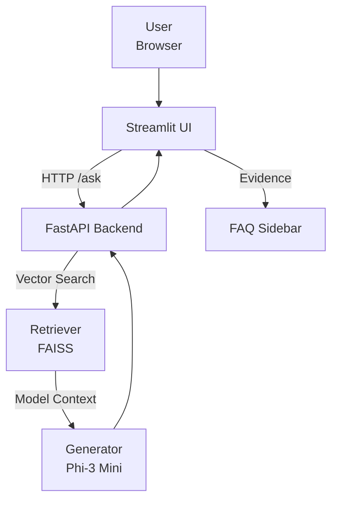
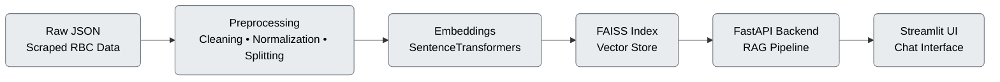
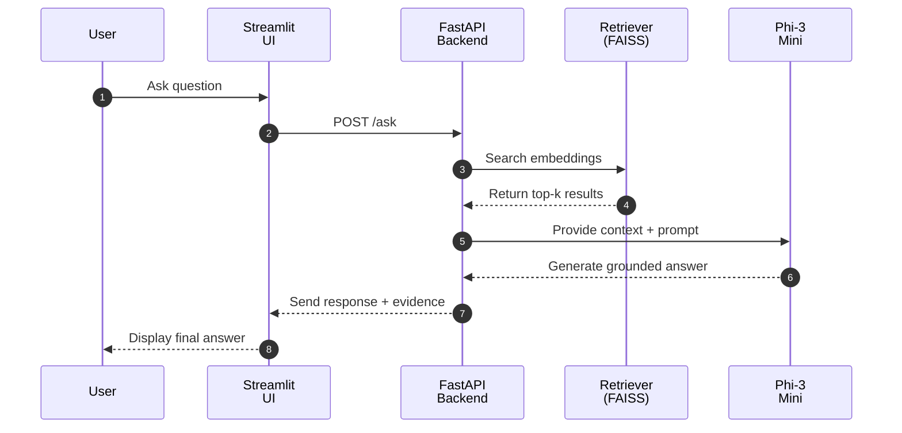

# 🧠 RAG Project  
*A Retrieval-Augmented Generation (RAG) System for Canadian Banking FAQs — starting with RBC*  


---

## 📘 Project Overview

This project builds an **end-to-end Retrieval-Augmented Generation (RAG)** pipeline for **Canadian banking FAQs**, beginning with **Royal Bank of Canada (RBC)**.

The system combines:
- **Semantic retrieval** using **FAISS + Sentence-Transformers**
- **Grounded text generation** with **Phi-3 Mini 4k Instruct**
- A **FastAPI backend** for retrieval + generation
- A **Streamlit chat interface** for interactive Q&A  
- All running securely inside **Google Colab** using **ngrok** tunnels.

If an answer is not found in the retrieved FAQs, the model responds exactly:  
> “I don’t know.”

---

## 🎯 Project Goals

- Develop a modular, explainable RAG system that can expand to other banks.  
- Ensure accuracy and prevent hallucinations via contextual grounding.  
- Demonstrate practical MLOps: experiment tracking, CI/CD, monitoring, and cloud readiness.  
- Support both **GPU** (T4) and **CPU** inference modes in Colab.

---

## 🧠 Model

- **Default:** `microsoft/Phi-3-mini-4k-instruct` (8-bit quantized)  
- **Why:** Lightweight, instruction-tuned, and efficient for Colab GPU (≈ 6 GB VRAM).  
- **Pipeline:**  
  - Tokenizer & model loaded via `transformers`  
  - Prompt template enforces factual, context-bound answers  
  - Returns concise responses (< 800 chars)

---

## 🧭 Architecture

### System Overview

**Shows the full request flow: user → UI → backend → retriever → generator → UI**.



### Data Flow

**Data flow showing the progression from raw data → preprocessing → embeddings → FAISS → backend → UI.**



### Sequence Diagram

**Full query lifecycle from user → retrieval → answer**.



---

## ⚙️ Tech Stack

| Layer               | Tools                                      |
| ------------------- | ------------------------------------------ |
| **Language**        | Python 3.12                                |
| **Backend**         | FastAPI + Uvicorn                          |
| **Frontend**        | Streamlit                                  |
| **Embeddings**      | Sentence-Transformers (`all-MiniLM-L6-v2`) |
| **Vector DB**       | FAISS-GPU                                  |
| **LLM**             | Microsoft Phi-3 Mini 4k Instruct           |
| **Infra / Tunnel**  | Ngrok (Colab Secrets)                      |
| **Version Control** | Git + GitHub (PAT Token auth)              |

---

## 🗂️ Project Structure

```bash
rag-project/
├─ src/
│  ├─ api/          # FastAPI backend (main.py)
│  ├─ frontend/     # Streamlit Chat UI (chat_ui.py)
│  ├─ ingestion/    # RBC FAQ scraping
│  ├─ preprocess/   # Cleaning and text splitting
│  ├─ embeddings/   # Embedding generation + FAISS index
│  ├─ retrieval/    # RbcRetriever (FAISS search)
│  ├─ generation/   # Phi-3 text generation
│  └─ utils/        # Helper scripts (e.g., sync_colab_url.py)
│
├─ data/
│  ├─ raw/          # Scraped RBC content
│  ├─ processed/    # Cleaned dataset
│  ├─ index/        # FAISS index + metadata
│  └─ reports/      # Data inspection / monitoring
│
├─ logs/            # Runtime and scraping logs
├─ requirements.txt
└─ README.md
```

---

## 🚀 Sprint Progress Tracker

| Sprint | Description | Progress | Status |
|:-------|:-------------|:----------|:--------|
| 🏁 **Sprint 1** | Data Ingestion (RBC FAQ scraping) | 🟩🟩🟩🟩🟩🟩🟩🟩🟩🟩 **100%** | ✅ Completed |
| 🧹 **Sprint 2** | Data Cleaning & Preprocessing | 🟩🟩🟩🟩🟩🟩🟩🟩🟩🟩 **100%** | ✅ Completed |
| 🧭 **Sprint 3** | Embeddings & FAISS Retrieval | 🟩🟩🟩🟩🟩🟩🟩🟩🟩🟩 **100%** | ✅ Completed |
| ⚙️ **Sprint 4** | Backend (FastAPI + RAG + Phi-3 Mini) | 🟩🟩🟩🟩🟩🟩🟩🟩🟩🟩 **100%** | ✅ Completed |
| 💬 **Sprint 5** | Frontend (Streamlit Chat UI) | 🟩🟩🟩🟩🟩🟩🟩🟩🟩🟩 **100%** | ✅ Completed |
| 📈 **Sprint 6** | Monitoring & Observability (WhyLogs + Evidently) | 🟩🟩🟩🟩⬜⬜⬜⬜⬜⬜ **40%** | 🚧 In Progress |
| ☁️ **Sprint 7** | GCP Cloud Deployment (Cloud Run + Terraform + CI/CD) | 🟩🟩⬜⬜⬜⬜⬜⬜⬜⬜ **20%** | ⏳ Planned |

---

### 🧩 Overall Project Completion:  
**🟩🟩🟩🟩🟩🟩🟩⬜⬜⬜ 75% Complete**

---

## ⚡ Running the Project (Colab)

### 1️⃣ Start Backend Server

```python
!nohup uvicorn src.api.main:app --host 0.0.0.0 --port 8000 > /content/rag-project/backend.log 2>&1 &
```

### 2️⃣ Expose Backend via ngrok

```python
from pyngrok import ngrok
from google.colab import userdata
import os, requests, time

token = userdata.get("NGROK_TOKEN")
ngrok.set_auth_token(token)
ngrok.kill()

backend_url = ngrok.connect(8000)
print("Backend API URL:", backend_url.public_url)

# Save for frontend
with open("/content/rag-project/rag_llm_url.txt", "w") as f:
    f.write(backend_url.public_url)

time.sleep(3)
print("Health:", requests.get(f"{backend_url.public_url}/health").json())
```

### 3️⃣ Start Streamlit Frontend

```python
!streamlit run /content/rag-project/src/frontend/chat_ui.py --server.port 8501 --server.address 0.0.0.0 > /content/rag-project/frontend.log 2>&1 &
```

### 4️⃣ Expose Frontend via ngrok

```python
frontend_url = ngrok.connect(8501)
print("Streamlit Chat UI:", frontend_url.public_url)
```

---

## 🧪 Example Query

**User:**

> How do I report a lost credit card?

**Model Output:**

> If your RBC credit card is lost or stolen, call 1-800-769-2512 immediately.
> You can also lock or unlock your card using RBC Online Banking or the Mobile App.

**Context:**
Displayed in Streamlit sidebar (top-3 retrieved FAQs).

---

## ☁️ Deployment & Version Control

* Git configured with PAT token via Colab Secrets
* Repo: [https://github.com/JDede1/rag-project](https://github.com/JDede1/rag-project)
* Push workflow:

```python
from google.colab import userdata
token = userdata.get("PAT_TOKEN")

!git config --global user.name "JDede1"
!git config --global user.email "dedenuolajibola@yahoo.com"
%cd /content/rag-project
!git add .
!git commit -m "Update project"
!git push https://{token}@github.com/JDede1/rag-project.git main
```

---

## 📊 Monitoring (Coming Soon – Sprint 6)

* Evidently AI for drift and quality monitoring
* Query + latency logging
* Lightweight Streamlit dashboard for feedback visualization

---

## 💡 Future Enhancements

* Replace Colab runtime with GCP Cloud Run deployment
* Integrate WhyLogs for data drift monitoring
* Add LangChain/LlamaIndex retrieval chains
* Expand FAQ coverage to TD, CIBC, BMO, Scotiabank

---

## 👨‍💻 Author

**Ajibola Dedenuola**
*Data Scientist · Machine Learning Engineer · MLOps Specialist*

🎓 M.Sc. Information Science & Machine Learning — University of Arizona
🔗 [GitHub](https://github.com/JDede1)

---

## 🪪 License

This project uses publicly available RBC FAQ content for **educational and research purposes**.
All trademarks and materials belong to **RBC Royal Bank**.

---

## 🚀 Quick Demo — Launch in Google Colab

You can instantly try the full RAG system (backend + frontend + ngrok tunnels) directly in Google Colab by clicking below:

[](https://colab.research.google.com/github/JDede1/rag-project/blob/main/notebooks/rag_colab_demo.ipynb)

> 💡 *Tip:* The demo notebook automatically installs dependencies, launches both backend and frontend, and provides you with a live public Streamlit chat URL.
