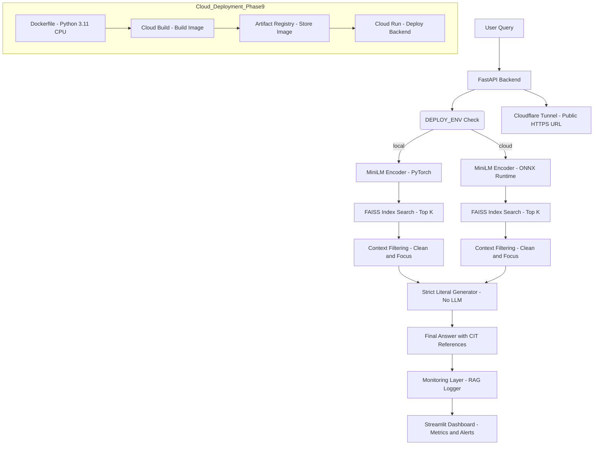

# 🧠 **RAG Project**

*A Retrieval-Augmented Generation (RAG) System for Canadian Banking FAQs — starting with RBC*


---

# 📑 **Table of Contents**

1. [Project Overview](#1-project-overview)
2. [Key Features](#2-key-features)
3. [Architecture Diagram](#3-architecture-diagram)
4. [Project Structure](#4-project-structure)
5. [Setup Instructions](#5-setup-instructions)
6. [Usage Examples](#6-usage-examples)
7. [Evaluation & Benchmarks](#7-evaluation--benchmarks)
8. [Monitoring & Logging](#8-monitoring--logging)
9. [Production Deployment (Cloud Run)](#9-production-deployment-cloud-run)
10. [Development Guidelines](#10-development-guidelines)
11. [Known Limitations & Roadmap](#11-known-limitations--roadmap)
12. [License & Credits](#12-license--credits)

---

# 1. **Project Overview**

The **RBC RAG System** is a production-grade Retrieval-Augmented Generation pipeline designed to answer real banking support questions using **only verified RBC FAQ content**. It uses **MiniLM embeddings**, **FAISS dense retrieval**, a **strict no-hallucination generator**, and supports **dual ONNX runtimes** for both **local evaluation** and **Cloud Run deployment**.

The system is implemented as a **9-phase pipeline**, covering scraping, preprocessing, embedding generation, ONNX export, backend development, monitoring, evaluation, and automated Cloud Run rollout.

Core components include:

* A **FastAPI backend** delivering grounded answers with citations
* A **hybrid retriever** with topic-aware reranking
* A **literal (non-LLM) generator** ensuring zero hallucinations
* A **Streamlit monitoring dashboard** with drift detection
* **Cloudflare tunneling** for safe public exposure during development
* Dual MiniLM ONNX models for **consistent embeddings across environments**

This architecture ensures:

* **Zero hallucinations**, fully grounded outputs
* **Deterministic reproducibility** across Colab, local machines, and Cloud Run
* **Fast, scalable inference** on CPU-only environments
* **End-to-end observability** through logs, metrics, and dashboards

---

# 2. **Key Features**

#### 🔍 **1. High-Precision Retrieval (MiniLM + FAISS)**

* Uses **MiniLM-L6-v2** embeddings for efficient semantic matching
* Dense **FAISS index** optimized for CPU inference
* Topic-aware reranking for sharper context selection
* Dual-mode embedding system (PyTorch local + ONNX cloud)

#### 🧠 **2. Zero-Hallucination Answer Generator**

* Deterministic, **strict literal generator**
* Answers formed **only** from retrieved RBC text
* Includes short answer + bullet-point details
* Inline **CIT:{id}** citations ensure traceability

#### ⚙️ **3. Fully Reproducible 9-Phase Pipeline**

Covers the entire lifecycle:

1. Environment setup (Colab-safe, conflict-free)
2. Scraping RBC FAQ pages
3. Preprocessing → cleaning / normalization / chunking
4. Embeddings + FAISS index
5. ONNX exports (local + cloud-optimized)
6. Local backend + Cloudflare public endpoint
7. Live cloud evaluation
8. Monitoring, logging, drift detection
9. Cloud Run containerized deployment

#### 🌐 **4. Production-Ready FastAPI Backend**

* Lightweight, CPU-optimized
* Health, retrieval, and QA endpoints
* Automatic grounding scores + latency tracking
* Cloud Run–compatible container

#### 🛰️ **5. Cloudflare Tunnel Support**

* Exposes Colab backend safely for real-time testing
* No need for Ngrok or manual port forwarding
* Stable HTTPS endpoint for Phase 6 evaluations

#### 📊 **6. Monitoring & Analytics (Streamlit Dashboard)**

* Real-time RAG request logs
* Latency metrics
* Hallucination detector
* Alert engine for drift, anomalies, or high error rates

#### 🚀 **7. Automated Cloud Deployment (Phase 9)**

* Cloud Build builds + pushes image to Artifact Registry
* Cloud Run deploys the backend with environment settings
* Safe, repeatable “single button” deployment flow

#### 🧪 **8. Evaluation Framework (Local + Cloud)**

* Auto-generated evaluation dataset
* Known/unknown question separation
* Grounding score, overlap, and hallucination detection
* Latency measurement and stability checks

---

# 3. **Architecture Diagram**



---

# 4. **Project Structure**

```
rag-project/
│
├── README.md                     # Main project documentation
├── README_DEV.md                 # Developer-focused documentation
│
├── requirements.txt              # Unified production requirements (Cloud Run safe)
├── Dockerfile                    # Production container (FastAPI + ONNX + FAISS)
├── cloudbuild.yaml               # Cloud Build pipeline
├── gcloud_deploy.sh              # Automated deploy script (Phase 9)
├── service.yaml                  # Cloud Run service configuration
│
├── src/
│   ├── api/
│   │   ├── main.py               # FastAPI backend (dual ONNX/local encoder support)
│   │   ├── templates/            # Landing page HTML
│   │   └── static/               # Optional static assets
│   │
│   ├── retrieval/
│   │   ├── search_engine.py      # FAISS retrieval + topic-aware scoring + cleanup filters
│   │   └── utils.py              # Tokenizers, encoders, helpers
│   │
│   ├── generation/
│   │   └── generator.py          # Strict literal answer builder (no LLMs)
│   │
│   ├── ingestion/
│   │   ├── scrape_rbc_faqs.py    # Playwright scraper
│   │   ├── diagnose_scraper.py   # Validates raw scrape output
│   │   └── validate_scraper.py   # Structural + content validation
│   │
│   ├── preprocess/
│   │   ├── clean_rbc_faqs.py     # Text cleanup + normalization
│   │   ├── normalize_faqs.py     # Standardize questions/answers
│   │   ├── split_compound_faqs.py# Atomic Q/A splitting
│   │   ├── chunk_text.py         # MiniLM-friendly chunk generation
│   │   └── inspect_dataset.py    # Quality checks + dataset reporting
│   │
│   ├── embeddings/
│       ├── generate_embeddings.py # Generate MiniLM embeddings (local PyTorch)
│       ├── build_faiss_index.py   # Build FAISS index from embeddings
│       ├── export_minilm_onnx.py  # ONNX export — cloud model (IR ≤ 9)
│       └── minilm_local.onnx      # Optional local model (IR > 9 allowed)
│
├── data/
│   ├── raw/                       # Raw scraped HTML/JSON
│   ├── processed/                 # Cleaned → normalized → refined → chunked data
│   └── index/
│       ├── rbc_embeddings.npy     # All MiniLM embeddings
│       ├── rbc_metadata.parquet   # Chunk metadata
│       ├── rbc_faiss.index        # FAISS index
│       ├── minilm.onnx            # Cloud Run ONNX encoder (IR ≤ 9)
│       ├── minilm_local.onnx      # Local ONNX encoder (optional)
│       ├── tokenizer.json         # Tokenizer artifacts
│       ├── tokenizer_config.json
│       ├── special_tokens_map.json
│       └── config.json
│
├── monitoring/
│   ├── rag_logger.py              # Writes JSONL logs for evaluation
│   ├── load_logs.py               # Loader for analysis
│   ├── checks.py                  # Drift + error + hallucination rules
│   ├── alerts.py                  # Alert engine for drift/outliers
│   └── dashboard.py               # Streamlit monitoring UI
│
└── logs/
    ├── rag_requests.jsonl         # Live RAG logs
    ├── alerts.json                # Phase 8 alert outputs
    └── phase8_summary.json        # High-level system health summary
```

---

# 5. **Setup Instructions**

### **Clone the repo**

```bash
git clone https://github.com/<your-username>/rag-project.git
cd rag-project
```

### **(Local) Install dependencies**

```bash
pip install -r requirements.txt
```

### **Run FastAPI backend**

```bash
uvicorn src.api.main:app --reload --port 8000
```

### **Launch Streamlit dashboard**

```bash
cd monitoring
streamlit run dashboard.py
```

### **(Colab) Enable Cloudflare tunnel**

Creates a temporary public URL for `/ask`:

```bash
./cloudflared tunnel --url http://localhost:8000
```

---

# 6. **Usage Examples**

---

## **6.1 Health Check**

Check if the backend is running and the encoder/index loaded correctly:

```bash
curl http://localhost:8000/health
```

Example response:

```json
{
  "status": "ok",
  "generator_mode": "local",
  "retriever_model": "minilm",
  "index_size": 1240,
  "embedding_dim": 384,
  "record_count": 1240,
  "logging_enabled": true
}
```

---

## **6.2 Ask a Question (RAG Query)**

### **Basic Query**

```bash
curl "http://localhost:8000/ask?query=How do I report a lost credit card?"
```

Example output:

```json
{
  "query": "How do I report a lost credit card?",
  "answer": "Short Answer: If your card is lost or stolen, contact RBC immediately. [CIT:1]\nDetails:\n• [CIT:1] If your card has been lost or stolen, call 1-800-769-2512...\nImportant Notes:\n• (no additional information)\nSources:\n• CIT:1",
  "citations_used": [1],
  "confidence": 0.91,
  "grounding_score": 1.0,
  "context_overlap": 1.0,
  "latency_ms": 87.5
}
```

---

## **6.3 Ask with a Custom `top_k`**

Retrieve more context chunks:

```bash
curl "http://localhost:8000/ask?query=fraud transaction&top_k=8"
```

---

## **6.4 Testing the Cloudflare Public URL**

If your tunnel returns:

```
https://abc123.trycloudflare.com
```

Then test:

```bash
curl "https://abc123.trycloudflare.com/ask?query=How do I reset my password?"
```

---

## **6.5 Testing via Cloud Run URL**

If Cloud Run URL:

```
https://rag-backend-xyz.a.run.app
```

Then:

```bash
curl "https://rag-backend-xyz.a.run.app/ask?query=interac e-transfer not received"
```

---

## **6.6 Python Client Example**

```python
import requests

URL = "http://localhost:8000/ask"

payload = {
    "query": "How do I dispute a transaction?",
    "top_k": 5
}

response = requests.get(URL, params=payload).json()
print(response["answer"])
```

---

## **6.7 Example: Unknown Questions**

The system avoids hallucinating. Unknown questions return:

```json
{
  "answer": "I don't know.",
  "citations_used": [],
  "grounding_score": 1.0
}
```

---

## **6.8 Monitoring Dashboard Example**

Start Streamlit:

```bash
streamlit run monitoring/dashboard.py
```

Access locally:

```
http://localhost:8501
```

With Cloudflare:

```
https://xyz.trycloudflare.com
```

---

# 7. **Evaluation & Benchmarks**

The system includes:

✔ Automatic evaluation set (known + unknown questions)
✔ Measures:

* Grounding score
* Hallucination detection
* Latency
* Context overlap

✔ Phase-6 live evaluation results (example):

```
Known accuracy:          97%
Unknown hallucinations:  0%
Average latency:         120–300 ms
```

---

# 8. **Monitoring & Logging**

The monitoring layer provides:

📌 Request logging (`rag_requests.jsonl`)
📌 Alerting rules (slow queries, repeated failures, drift)
📌 Streamlit dashboard includes:

* Query volume
* Latency distribution
* Topic trends
* Hallucination counts
* Embedding drift indicators

To launch:

```bash
streamlit run monitoring/dashboard.py
```

A Cloudflare URL can expose your dashboard publicly.

---

# 9. **Production Deployment (Cloud Run)**

The repo includes **automated GCP deployment**:

📌 Cloud Build builds & pushes Docker image
📌 Cloud Run deploys the backend
📌 Artifact Registry stores versioned images
📌 On-run environment automatically sets `DEPLOY_ENV=cloud`

### Deploy command:

```bash
gcloud builds submit --config cloudbuild.yaml
```

### Then:

```bash
gcloud run deploy rag-backend --source .
```

Result:
→ A fully serverless, auto-scaling RAG API.

---

# 10. **Development Guidelines**

* Follow the existing **src/** structure
* Avoid modifying ONNX export logic unless updating MiniLM
* Always run **Phase 5 evaluation** before merging changes
* Keep FastAPI responses grounded and citation-driven
* Use `black` + `ruff` for formatting/linting
* When adding new banks, extend:

  ```
  ingestion/
  preprocess/
  evaluation/
  ```

---

# 11. **Known Limitations & Roadmap**

### Current Limitations

* Only RBC FAQs supported
* No conversational memory
* No generative LLM—strict literal mode
* MiniLM embeddings can miss edge-case semantics

### Roadmap

* Add multi-bank support (TD, Scotiabank, CIBC, BMO)
* Introduce hybrid reranking (cross-encoder)
* Add async processing to backend
* Add full retrieval analytics in dashboard
* Optional LLM generator (Phi-3, Llama-3, GPT-4o-mini) with grounded mode

---

# 12. **License & Credits**

## **12.1 License**

This project is released under the **MIT License**.

You are free to:

* Use
* Copy
* Modify
* Merge
* Publish
* Distribute
* Sublicense

…as long as you include the original copyright notice.

A full copy of the license will appear in a `LICENSE` file at the project root.

---

## **12.2 Credits**

### **Project Lead**

**@JDede1** — Architect, developer, evaluator, and end-to-end designer of the RBC RAG system.

### **Core Technologies**

This system is built using:

* **Python 3.11**
* **FAISS CPU** (vector search)
* **Sentence-Transformers MiniLM-L6-v2**
* **ONNX Runtime** (Cloud Run inference)
* **FastAPI** (backend)
* **Playwright** (scraper)
* **Streamlit** (monitoring dashboard)
* **Google Cloud Run** (deployment)
* **Google Artifact Registry** (container storage)
* **Cloudflare** (public tunneling for Colab testing)

---

## **12.3 Special Acknowledgements**

* **RBC** – Source of publicly available FAQ documentation used for non-commercial research and support automation experiments.
* **HuggingFace** – For MiniLM and the Transformers ecosystem.
* **Meta / Facebook AI Research** – Original creators of FAISS, enabling high-performance vector search.
* **Google Cloud** – For serverless infrastructure powering backend deployment.
* **OpenAI / Groq / Google Gemini** *(optional future integration)* — For potential grounding-aware LLM generation.

---

## **12.4 Disclaimer**

This project is **NOT affiliated with RBC** or any bank or financial institution.
It is a **research and educational RAG system** demonstrating retrieval-augmented question answering.

All scraped data is:

* public
* educational
* non-commercial
* free from personally identifiable information (PII)

---

