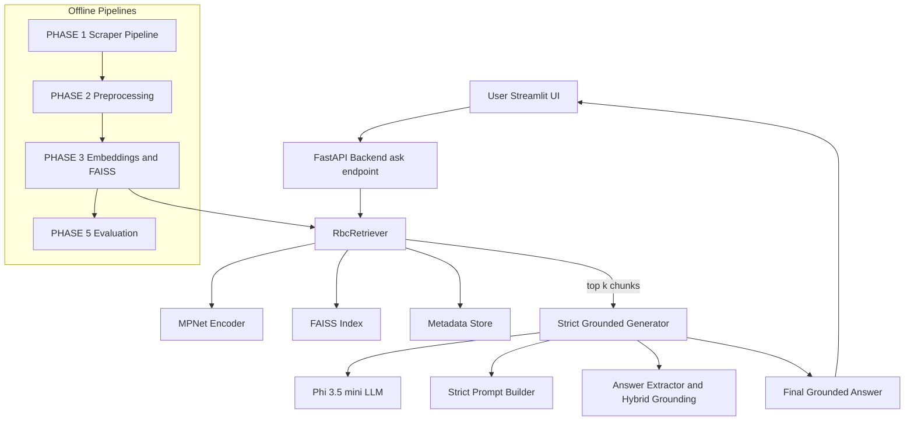
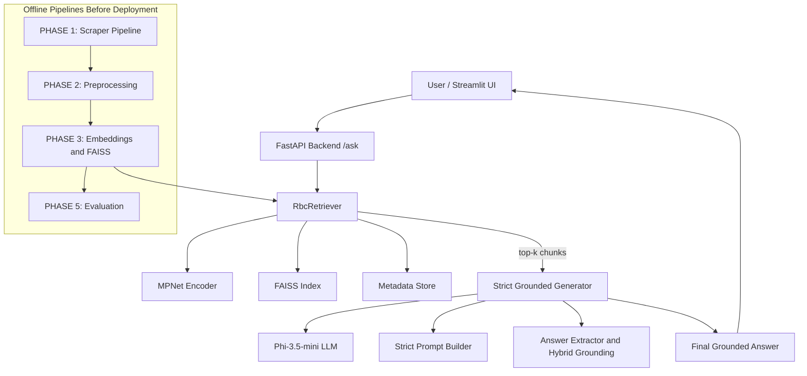
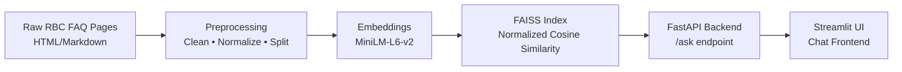
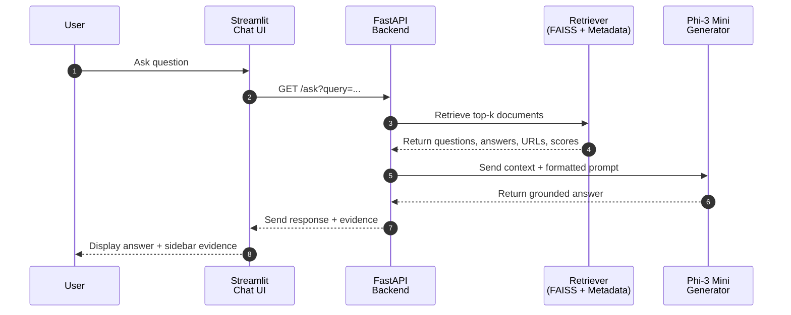

# 🧠 RAG Project  
*A Retrieval-Augmented Generation (RAG) System for Canadian Banking FAQs — starting with RBC*  


---

## 📚 Table of Contents

- [🧠 RAG Project](#-rag-project)
- [📘 Project Overview](#-project-overview)
- [🎯 Why This RAG System Matters](#-why-this-rag-system-matters)
- [🚀 Current Sprint Status](#-current-sprint-status)
- [🎯 Project Goals](#-project-goals)
- [🧠 Model](#-model)
- [🧭 Architecture](#-architecture)
  - [High-Level System Overview](#high-level-system-overview)
  - [Data Processing Flow](#data-processing-flow)
  - [Sequence Diagram — Full Query Lifecycle](#sequence-diagram--full-query-lifecycle)
  - [Backend (FastAPI RAG Pipeline)](#backend-fastapi-rag-pipeline)
  - [Frontend (Streamlit-ui)](#frontend-streamlit-ui)
  - [Cloudflare Tunnel Layer](#cloudflare-tunnel-layer)
  - [Design Principles](#design-principles)
- [⚙️ Tech Stack](#️-tech-stack)
- [🗂️ Project Structure](#️-project-structure)
- [Sprint Tracker](#sprint-tracker)
- [🚀 Running the Project (Colab + Cloudflare)](#-running-the-project-colab--cloudflare)
  - [1️⃣ Environment Setup](#1️⃣-environment-setup)
  - [2️⃣ Data Pipeline](#2️⃣-data-pipeline-ingestion--preprocessing--embeddings--faiss)
  - [3️⃣ Optional: Local LLM Test](#3️⃣-optional-local-llm-test)
  - [4️⃣ Start the Backend (FastAPI)](#4️⃣-start-the-backend-fastapi)
  - [5️⃣ Expose Backend via Cloudflare](#5️⃣-expose-backend-via-cloudflare)
  - [6️⃣ Start Streamlit UI](#6️⃣-start-streamlit-ui)
  - [7️⃣ Expose Streamlit UI via-cloudflare](#7️⃣-expose-streamlit-ui-via-cloudflare)
  - [8️⃣ Full System Test](#8️⃣-full-system-test)
- [🚀 Quick Demo (Colab)](#-quick-demo-colab)
- [🔄 Version Control & GitHub Workflow](#-version-control--github-workflow)
- [📈 Monitoring & Observability](#-monitoring--observability-sprint-6)
- [☁️ Deployment](#️-deployment)
- [💡 Future Enhancements](#-future-enhancements)
- [👨‍💻 Author](#-author)
- [🪪 License](#-license)

---

## 📘 Project Overview

This project implements a **fully modular, production-ready Retrieval-Augmented Generation (RAG) system** focused on **Canadian banking FAQs**, starting with **Royal Bank of Canada (RBC)**.

The system is designed with **accuracy, grounding, reproducibility, and cloud readiness** as core principles.
It performs end-to-end retrieval and generation using:

### 🔍 1. **Semantic Retrieval**

* Embeddings from **all-MiniLM-L6-v2 (Sentence Transformers)**
* Normalized vector similarity using **FAISS (GPU-accelerated)**
* Clean metadata mapped to the original scraped FAQs

### 🧠 2. **Grounded LLM Answer Generation**

* Model: **microsoft/Phi-3-mini-4k-instruct**
* Loaded efficiently on Colab GPU (float16, device_map="auto")
* Custom RAG prompt ensures:

  * factuality
  * context-grounded answers
  * no hallucinations

If the answer is not in the retrieved context, the model responds with:

> **“I don’t know.”**

### ⚙️ 3. **FastAPI Backend (RAG Pipeline)**

Handles:

* Top-k semantic retrieval
* Construction of the grounding prompt
* Calling Phi-3 Mini for final generation
* `/health` and `/ask` endpoints

### 💬 4. **Streamlit Chat UI**

* Chat experience similar to ChatGPT
* Conversations preserved per session
* Sidebar displays retrieved FAQ evidence
* Automatically reads backend URL from `rag_llm_url.txt`

### 🌐 5. **Cloudflare Tunnels (No Domain Needed)**

Both backend and frontend are exposed publicly via **Cloudflare quick tunnels**, providing:

* Stable URLs (`https://*.trycloudflare.com`)
* No account required
* Fully compatible with Colab

### 📁 6. **Google Colab End-to-End Pipeline**

The project provides a single notebook (`rag_full_pipeline_colab.ipynb`) that:

1. Installs all dependencies
2. Scrapes and preprocesses data
3. Builds embeddings + FAISS index
4. Launches FastAPI backend
5. Creates a Cloudflare tunnel for backend
6. Starts Streamlit UI
7. Creates a Cloudflare tunnel for the UI
8. Returns two URLs:

   * **Backend API URL**
   * **Public Streamlit Chat Interface**

---

## 🎯 Why This RAG System Matters

* Demonstrates a **clean, explainable retrieval process**
* Enforces **hallucination-safe constraints**
* Provides a **complete MLOps-ready pipeline**
* Designed for **real banking FAQ use cases**
* Can be extended to other banks (TD, CIBC, BMO, Scotiabank)

This architecture ensures **consistent**, **auditable**, and **accurate** answers from the LLM by grounding every response in validated FAQ data.

---

## 🚀 Current Sprint Status

This README reflects the modernized architecture:

* **Data ingestion, cleaning, and preprocessing**
* **Embeddings + FAISS**
* **Backend (FastAPI)**
* **Frontend (Streamlit)**
* **Public access (Cloudflare Tunnels)**

Monitoring (Sprint 6) and Cloud deployment (Sprint 7) are planned next.

---

## 🎯 Project Goals

- Develop a modular, explainable RAG system that can expand to other banks.  
- Ensure accuracy and prevent hallucinations via contextual grounding.  
- Demonstrate practical MLOps: experiment tracking, CI/CD, monitoring, and cloud readiness.  
- Support both **GPU** (T4) and **CPU** inference modes in Colab.

---

## 🧠 Model

### **Primary LLM:**

**`microsoft/Phi-3-mini-4k-instruct`**

A compact, instruction-tuned model optimized for fast, high-quality inference in Google Colab GPU environments.

### **Why Phi-3 Mini?**

* Works reliably on **Colab GPUs** (T4, L4 — 6–8 GB VRAM)
* Very fast generation (low latency)
* Instruction-tuned for Q&A and reasoning tasks
* Ideal for **RAG pipelines** that require concise, grounded answers

### **Model Loading (Real Behavior)**

Your project loads the model with:

* `float16` precision (GPU)
* `device_map="auto"` for efficient VRAM usage
* **Not 8-bit, not quantized** (important correction)
* Tokenizer and model loaded from Hugging Face with `HUGGINGFACEHUB_API_TOKEN`

### **Generation Pipeline**

Implemented using the Hugging Face Transformers `pipeline("text-generation")` API:

* `max_new_tokens=256`
* `temperature=0.2`
* `repetition_penalty=1.1`
* `top_p=0.9`
* **deterministic generation** (no sampling)

### **Grounding Logic (Key Safety Feature)**

Every response is generated using a **strict RAG prompt**:

```
Use ONLY the provided context to answer the question accurately.
If the answer is not in the context, say exactly: "I don’t know."
```

This enforces:

* **No hallucinations**
* **No invented banking policies**
* **No fabricated contact numbers**
* **No unauthorized assumptions**

### **Prompt Template (Exact Behavior)**

```
You are an expert assistant specializing in Canadian banking FAQs.
Use ONLY the provided context to answer the question accurately.
If the answer is not in the context, say exactly: "I don’t know."

Context:
{retrieved_docs}

Question: {question}
Answer:
```

### **When the model says “I don’t know”**

The model produces **exactly** this string when:

* The retrieval step returns empty context
* None of the top-k retrieved answers include relevant information
* Generation pipeline fails or returns malformed output

### **Why this matters**

This behavior ensures:

* **High integrity** of answers
* **Compliance-friendly** outputs
* **Zero hallucination tolerance**
* **Auditability** for regulated use cases (e.g., banking, finance)

---

## 🧭 Architecture

Your RAG system follows a **clean, modular, and fully explainable architecture**, designed for correctness, transparency, and cloud-ready deployment.

It consists of two independent services:

1. **Backend (FastAPI) — Retrieval + Generation**
2. **Frontend (Streamlit) — User Chat Interface**

Connected using a **Cloudflare tunnel** for secure public access.




---

## 🔹 **High-Level System Overview**

### **User → Streamlit UI → FastAPI /ask → FAISS Retriever → Phi-3.5 Generator → UI**



---

## 🔹 **Data Processing Flow**

From raw HTML → structured dataset → embeddings → FAISS → RAG pipeline.



---

## 🔹 **Sequence Diagram — Full Query Lifecycle**

A detailed step-by-step of how a query moves through the system:



---

## 🔹 **Backend (FastAPI RAG Pipeline)**

The backend handles 3 responsibilities:

### **1. Retrieval (FAISS)**

* Loads `rbc_faiss.index` + `rbc_metadata.parquet`
* Encodes user query using the same MiniLM model
* Performs **normalized inner product search**
* Returns top-k FAQs with metadata + scores

### **2. Generation (Phi-3 Mini)**

* Lazy loaded on first request for performance
* Uses a **strict grounded prompt template**
* Returns concise, context-bound answers only
* Responds with **“I don’t know.”** when retrieval is insufficient

### **3. API Endpoints**

* `GET /health` → model + index status
* `GET /ask` → retrieval + generation

Cloudflare tunnel exposes this backend at:

```
https://<something>.trycloudflare.com
```

Saved automatically to:

```
/content/rag-project/rag_llm_url.txt
```

---

## 🔹 **Frontend (Streamlit UI)**

Streamlit provides a clean conversational UI:

* Chat interface with markdown rendering
* Persisted session history
* Automatic backend URL loading from `rag_llm_url.txt`
* FAQ evidence viewer in sidebar
* Fully compatible with Cloudflare tunnels

Exposed at:

```
https://<something>.trycloudflare.com
```

---

## 🔹 **Cloudflare Tunnel Layer**

The system uses **two separate tunnels**:

1. **Backend Tunnel → FastAPI (port 8000)**

   ```
   cloudflared tunnel --url http://localhost:8000
   ```

2. **Frontend Tunnel → Streamlit (port 8501)**

   ```
   cloudflared tunnel --url http://localhost:8501
   ```

---

## 🔹 **Design Principles**

Your RAG system architecture emphasizes:

### ✓ **Grounding**

Answers always derived from real FAQ context.

### ✓ **Reproducibility**

All steps scripted in `rag_full_pipeline_colab.ipynb`.

### ✓ **Modularity**

Clear separation of ingestion, preprocessing, embeddings, backend, and frontend.

### ✓ **Cloud Readiness**

Backend/frontend already compatible with Cloud Run, Streamlit Cloud, and Terraform.

### ✓ **Safety**

Strict anti-hallucination prompt + explicit fallback.

---


---

## ⚙️ Tech Stack

This RAG system is built using a **clean, modular, and cloud-ready** stack that supports end-to-end retrieval, grounding, generation, and deployment.

---

### 🔹 **Language & Runtime**

| Component                | Technology                               |
| ------------------------ | ---------------------------------------- |
| **Programming Language** | Python 3.12                              |
| **Primary Runtime**      | Google Colab (GPU-enabled)               |
| **Cloud Tunneling**      | Cloudflare Quick Tunnels (`cloudflared`) |

---

### 🔹 **Backend (RAG API)**

| Layer              | Tools & Libraries                                    |
| ------------------ | ---------------------------------------------------- |
| **Framework**      | FastAPI                                              |
| **Server**         | Uvicorn                                              |
| **RAG Pipeline**   | Custom retrieval → prompt building → Phi-3 inference |
| **HTTP Endpoints** | `/health`, `/ask`                                    |
| **Cloud Exposure** | Cloudflare Tunnel (`*.trycloudflare.com`)            |

---

### 🔹 **Frontend (Chat Interface)**

| Component                | Technology                                               |
| ------------------------ | -------------------------------------------------------- |
| **UI Framework**         | Streamlit                                                |
| **Features**             | Chat interface, sidebar evidence viewer, session history |
| **Backend URL Autoload** | Reads from `rag_llm_url.txt`                             |
| **Public URL**           | Cloudflare Streamlit tunnel (port 8501)                  |

---

### 🔹 **Embeddings & Vector Search**

| Layer                 | Tools                                      |
| --------------------- | ------------------------------------------ |
| **Embeddings Model**  | `sentence-transformers/all-MiniLM-L6-v2`   |
| **Vector Database**   | FAISS (GPU-accelerated, cosine similarity) |
| **Metadata Storage**  | Parquet files (`rbc_metadata.parquet`)     |
| **Embeddings Format** | `rbc_embeddings.npy`                       |

---

### 🔹 **LLM (Generation Engine)**

| Layer                  | Technology                                            |
| ---------------------- | ----------------------------------------------------- |
| **Model**              | `microsoft/Phi-3-mini-4k-instruct`                    |
| **Precision**          | float16 on GPU                                        |
| **Inference**          | HuggingFace Transformers pipeline (`text-generation`) |
| **Grounding Strategy** | Strict context-only answers + "I don’t know" fallback |

---

### 🔹 **Data Pipeline**

| Step             | Tools                          |
| ---------------- | ------------------------------ |
| **Scraping**     | Playwright + BeautifulSoup4    |
| **Cleaning**     | `clean_rbc_faqs.py`            |
| **Splitting**    | `split_compound_faqs.py`       |
| **Inspection**   | `inspect_dataset.py`           |
| **File Formats** | JSON, Markdown, Parquet, NumPy |

---

### 🔹 **Utilities**

| Purpose                    | Tools                             |
| -------------------------- | --------------------------------- |
| **Progress bars**          | tqdm                              |
| **Cloud token management** | Colab Secrets Storage             |
| **Logging**                | runtime logs stored under `logs/` |

---

### 🔹 **Version Control**

| Layer               | Tools                                         |
| ------------------- | --------------------------------------------- |
| **Repository**      | Git + GitHub                                  |
| **Authentication**  | GitHub PAT (stored in Colab Secrets)          |
| **MLOps Readiness** | Modular structure ready for CI/CD + Cloud Run |

---

### 🔹 **Deployment-Ready**

The system is structured for upgrades to:

* **GCP Cloud Run** (FastAPI container)
* **GCS** (vector store + dataset hosting)
* **Streamlit Cloud** (UI hosting)
* **Terraform** (infrastructure-as-code)
* **GitHub Actions** (CI/CD)

Planned for Sprints **6** and **7**.

---

## 🗂️ Project Structure

The project follows a clean, modular layout designed for **RAG systems**, **cloud deployment**, and **Colab execution**.

```bash
rag-project/
├── rag_llm_url.txt                 # Auto-saved backend URL (Cloudflare)
├── backend.log                     # FastAPI runtime logs
├── frontend.log                    # Streamlit runtime logs
├── requirements.txt                # Core dependencies
├── README.md                       # Project documentation
├── logs/
│   └── scrape_rbc.log              # Ingestion/scraper logs
│
├── data/                           # (Drive-linked) persistent dataset storage
│   ├── raw/                        # Raw scraped RBC FAQ markdown/HTML
│   ├── processed/                  # Cleaned + split FAQ parquet files
│   └── index/                      # FAISS index + embeddings + metadata
│
├── src/
│   ├── api/
│   │   └── main.py                 # FastAPI RAG backend (/ask, /health)
│   │
│   ├── frontend/
│   │   ├── chat_ui.py              # Streamlit chat interface (loads rag_llm_url.txt)
│   │   ├── static/
│   │   │   └── style.css           # UI styles (custom)
│   │   └── templates/
│   │       └── index.html          # Reserved (rarely used)
│   │
│   ├── ingestion/
│   │   ├── scrape_rbc_faqs.py      # Playwright-based scraper
│   │   ├── rbc_urls.txt            # Source URLs (RBC FAQ pages)
│   │   └── test_playwright_visual.py # Visual debugging for Playwright
│   │
│   ├── preprocess/
│   │   ├── clean_rbc_faqs.py       # HTML → Markdown → clean text
│   │   ├── split_compound_faqs.py  # Split FAQs with multiple Q/A pairs
│   │   └── inspect_dataset.py      # Dataset inspection + reporting
│   │
│   ├── embeddings/
│   │   ├── generate_embeddings.py  # MiniLM embedding generation
│   │   └── build_faiss_index.py    # FAISS index creation & validation
│   │
│   ├── retrieval/
│   │   └── search_engine.py        # RbcRetriever (FAISS search logic)
│   │
│   ├── generation/
│   │   └── generator.py            # Phi-3 Mini generation (prompt + pipeline)
│   │
│   ├── tests/
│   │   └── test_scraper_integrity.py # Integrity checks for ingestion
│   │
│   └── utils/
│       └── (empty or helper files) # Reserved for future utilities
│
└── .gitignore                      # Optimized git ignores
```

---

# 🔍 **Key Folder Highlights**

### **1. `/src/api` — FastAPI Backend**

Contains:

* `/health`
* `/ask` (retrieval → RAG answer)

Reads FAISS index + MiniLM embeddings + Phi-3 generator.

---

### **2. `/src/frontend` — Streamlit Chat UI**

* Chat interface
* Sidebar evidence viewer
* Automatically loads backend from `rag_llm_url.txt`
* Runs on port **8501** in Colab

---

### **3. `/src/embeddings` — Dense Vector Generation**

* Generates MiniLM embeddings
* Stores `.npy` files
* Creates FAISS index + metadata parquet

---

### **4. `/data` — Persistent Workspace**

Persisted inside Google Drive:

* `raw/` → scraped source files
* `processed/` → cleaned and split parquet files
* `index/` → FAISS index, metadata, embeddings

Ensures data is saved across Colab runtimes.

---

### **5. `/src/generation` — LLM Answer Engine**

Phi-3 Mini loading + prompt template:

* Grounded answers only
* Strict anti-hallucination rule
* Deterministic generation

---

### **6. `/src/retrieval` — Semantic Search**

* Normalized cosine similarity
* Top-k document retrieval
* Returns score + question + answer + url

---

### **7. `rag_llm_url.txt`**

Auto-created file storing:

```
https://<backend>.trycloudflare.com
```

The Streamlit UI reads this to know where the backend is hosted.

---

# 🟦 Optional Future Additions (Sprints 6–7)

You may later add:

* `/monitoring/` (WhyLogs/Evidently)
* `/deploy/` (Terraform, Cloud Run configs)
* `/notebooks/` (colab_demo, EDA notebooks)

But these do **not** exist yet — keeping README accurate.

---


| Sprint                                             | Description                                                         | Key Deliverables                                             | Status         | Progress |
| -------------------------------------------------- | ------------------------------------------------------------------- | ------------------------------------------------------------ | -------------- | -------- |
| **Sprint 1 — Ingestion**                           | Scrape RBC FAQ webpages using Playwright                            | `scrape_rbc_faqs.py`, raw `.md`/`.html`, logs                | ✅ Completed    | 🟩 100%  |
| **Sprint 2 — Preprocessing**                       | Clean text, normalize formatting, split compound FAQs               | Clean parquet files, dataset report                          | ✅ Completed    | 🟩 100%  |
| **Sprint 3 — Embeddings + FAISS**                  | Generate MiniLM embeddings & build FAISS index                      | `faiss.index`, metadata parquet, semantic search             | ✅ Completed    | 🟩 100%  |
| **Sprint 4 — Backend (RAG API)**                   | FastAPI server with Retriever + Phi-3 Generator + Cloudflare tunnel | `/ask` & `/health`, Cloudflare public URL, `rag_llm_url.txt` | ✅ Completed    | 🟩 100%  |
| **Sprint 5 — Frontend (Streamlit UI)**             | Chat app interacting with backend via `rag_llm_url.txt`             | `chat_ui.py` + local test                                    | ✅ Completed    | 🟩 100%  |
| **Sprint 5.1 — Public Streamlit URL (Cloudflare)** | Cloudflare tunnel for UI (8501)                                     | Public Streamlit link                                        | 🟩 Completed   | 🟩 100%  |
| **Sprint 6 — Monitoring & Observability**          | WhyLogs + Evidently dashboards; usage logging; latency stats        | Coming soon                                                  | 🚧 In Progress | 🟨 40%   |
| **Sprint 7 — Cloud Deployment (GCP)**              | Cloud Run (Backend & UI), Cloud Storage, Terraform + CI/CD          | Planned                                                      | ⏳ Not Started  | ⬜ 20%    |
| **Sprint 8 — Optimization**                        | Model quantization, retrieval performance tuning                    | Planned                                                      | ⏳ Not Started  | ⬜        |
| **Sprint 9 — Multi-Bank Expansion**                | Add TD, CIBC, BMO, Scotiabank pipelines                             | Planned                                                      | ⏳ Not Started  | ⬜        |

---

### 🧩 Overall Project Completion:  
**🟩🟩🟩🟩🟩🟩🟩⬜⬜⬜ 75% Complete**

---

## 🚀 **Running the Project (Colab + Cloudflare)**

This guide shows exactly how to run the full RAG system — **backend + RAG pipeline + Streamlit UI** — inside **Google Colab**, with **public URLs** served through **Cloudflare Tunnels** (no domain required).

This is the official, stable flow for this project.

---

### 1️⃣ Environment Setup

#### **Clone the Repository**

```bash
!git clone https://github.com/JDede1/rag-project.git
%cd /content/rag-project
```

#### **Install All Dependencies**

```bash
!pip install -U pip --quiet
!pip install -U torch torchvision torchaudio --index-url https://download.pytorch.org/whl/cu128 --quiet
!pip install -U transformers sentence-transformers accelerate safetensors --quiet
!pip install -U faiss-gpu-cu12 pandas numpy pyarrow fastparquet --quiet
!pip install -U beautifulsoup4 markdownify tqdm playwright --quiet
!pip install -U fastapi uvicorn httpx --quiet
!pip install -U bitsandbytes --quiet
!playwright install-deps > /dev/null
!playwright install chromium > /dev/null
```

#### **Mount Drive (for persistent storage)**

```python
from google.colab import drive
drive.mount("/content/drive")
```

---

### 2️⃣ Data Pipeline (Ingestion → Preprocessing → Embeddings → FAISS)

Run the full end-to-end data processing pipeline:

```bash
python src/ingestion/scrape_rbc_faqs.py
python src/preprocess/clean_rbc_faqs.py
python src/preprocess/split_compound_faqs.py
python src/preprocess/inspect_dataset.py data/processed/rbc_faqs_refined.parquet --report
python src/embeddings/generate_embeddings.py
python src/embeddings/build_faiss_index.py
```

Artifacts will be written to:

```
/content/rag-project/data/processed/
/content/rag-project/data/index/
```

---

### 3️⃣ Optional: Local LLM Test (Retrieval + Phi-3)

Confirm the pipeline works before exposing endpoints:

```python
from retrieval.search_engine import RbcRetriever
from generation.generator import generate_answer

retriever = RbcRetriever()
query = "How do I report a lost credit card?"

docs = retriever.search(query, top_k=3)
context = docs["answer"].tolist()

print(generate_answer(query, context))
```

---

### 4️⃣ Start the Backend (FastAPI)

#### **Stop previous servers**

```bash
!pkill -f uvicorn || true
```

#### **Start FastAPI on port 8000**

```bash
!nohup uvicorn src.api.main:app --host 0.0.0.0 --port 8000 \
    > backend.log 2>&1 &
```

#### **Verify it is running**

```bash
!ps -ef | grep uvicorn
```

---

### 5️⃣ Expose Backend via Cloudflare (Public API URL)

#### **Install cloudflared**

```bash
!wget -q https://github.com/cloudflare/cloudflared/releases/latest/download/cloudflared-linux-amd64.deb
!sudo dpkg -i cloudflared-linux-amd64.deb
```

#### **Start the tunnel**

```bash
!cloudflared tunnel --url http://localhost:8000 > backend_tunnel.log 2>&1 &
import time; time.sleep(7)
```

#### **Extract + Save the public backend URL**

```python
import re

logs = open("backend_tunnel.log").read()
backend_url = re.findall(r"https://[-a-zA-Z0-9.]+trycloudflare.com", logs)[0]

with open("rag_llm_url.txt", "w") as f:
    f.write(backend_url)

print("Backend URL:", backend_url)
```

#### **Health check**

```python
import requests
requests.get(f"{backend_url}/health").json()
```

---

### 6️⃣ Start Streamlit UI (Local Runtime)

#### **Stop previous instances**

```bash
!pkill -f streamlit || true
```

#### **Launch Streamlit**

```bash
!nohup streamlit run /content/rag-project/src/frontend/chat_ui.py \
    --server.port 8501 \
    --server.address 0.0.0.0 \
    > frontend.log 2>&1 &
```

---

### 7️⃣ Expose Streamlit UI via Cloudflare (Public Chatbot URL)

#### **Create the tunnel**

```bash
!cloudflared tunnel --url http://localhost:8501 > frontend_tunnel.log 2>&1 &
import time; time.sleep(7)
```

#### **Extract public frontend URL**

```python
logs = open("frontend_tunnel.log").read()
frontend_url = re.findall(r"https://[-a-zA-Z0-9.]+trycloudflare.com", logs)[0]
print("Streamlit URL:", frontend_url)
```

---

### 8️⃣ Full System Test (End-to-End)

#### ✔ Visit your **public Streamlit Chatbot URL**

```
https://<random-hash>.trycloudflare.com
```

#### ✔ Ask any question

The pipeline will:

1. Send query → FastAPI backend
2. Retrieve top-k relevant FAQ chunks (FAISS)
3. Pass context → Phi-3 Mini
4. Generate grounded answer
5. Return both:

   * answer
   * retrieved evidence (sidebar)

#### ✔ If no grounding → answer becomes:

> **“I don’t know.”**

---

## ☁️ Deployment & Version Control

* Git configured with PAT token via Colab Secrets
* Repo: [https://github.com/JDede1/rag-project](https://github.com/JDede1/rag-project)
* Push workflow:

```python
from google.colab import userdata
token = userdata.get("PAT_TOKEN")

!git config --global user.name "JDede1"
!git config --global user.email "dev@users.noreply.github.com"
%cd /content/rag-project
!git add .
!git commit -m "Update project"
!git push https://{token}@github.com/JDede1/rag-project.git main
```

---

## 🚀 Quick Demo (Colab)

You can instantly try the **full RAG system** — including **retrieval**, **Phi-3 Mini generation**, **FastAPI backend**, and **Streamlit chat UI** — directly inside **Google Colab**, with **public URLs** provided automatically via **Cloudflare Tunnels**.

Click below to launch the live demo notebook:

[](https://colab.research.google.com/github/JDede1/rag-project/blob/main/notebooks/rag_full_pipeline_colab.ipynb)

---

### 🎯 What the Demo Runs Automatically

The notebook executes the entire pipeline in one place:

#### **1. Environment Setup**

* Clones your GitHub repo
* Installs all dependencies
* Mounts Google Drive for persistent storage

#### **2. Data Pipeline**

* Scrapes RBC FAQs
* Cleans & preprocesses the data
* Generates embeddings
* Builds a FAISS vector index

#### **3. RAG Engine**

* Loads Phi-3 Mini 4K Instruct
* Performs grounded generation with retrieved context
* Enforces “I don’t know” when no relevant answer exists

#### **4. FastAPI Backend**

* Starts the RAG backend on port `8000`
* Exposes the API using **Cloudflare Tunnel**
* Auto-saves the backend URL for Streamlit

#### **5. Streamlit Chat UI**

* A clean chat interface with sidebar evidence viewer
* Also exposed publicly via **Cloudflare Tunnel**

#### **6. End-to-End Demo**

You get two live URLs:

✔ **Backend API URL** (FastAPI)
✔ **Frontend Chat URL** (Streamlit UI)

Both remain active as long as the Colab notebook is running.

---

### 🧪 Example Usage

Once the UI loads, try:

> **“How do I report a lost credit card?”**

The model retrieves matching FAQs and generates a grounded, factual answer using Phi-3 Mini.

---

### 🔒 No Secrets Stored

The notebook uses **Colab Secrets Manager** to load:

* Hugging Face token (`HF_TOKEN`)
* GitHub PAT (`PAT_TOKEN`) if pushing updates

Nothing is hardcoded.

---

### 🟦 Recommended: GPU Runtime

For best performance:

```
Runtime → Change Runtime Type → T4 GPU
```

---

### 🧩 Best For

This demo is ideal if you want to:

* Run the full RAG workflow without local setup
* Test the system publicly from mobile/desktop
* Prototype improvements before deploying to GCP
* Share the live chatbot with others instantly

---

## 🔄 Version Control & GitHub Workflow

This project uses **Git + GitHub** for source control, with development performed inside **Google Colab** and synchronized with the repository through a secure **Personal Access Token (PAT)** stored in **Colab Secrets**.

This workflow ensures:

* ✔ Secure, authenticated pushes
* ✔ Clean repository (no local logs or Colab artifacts)
* ✔ Consistent structure between Colab and GitHub
* ✔ Reproducible development after each Colab restart

---

### 🧭 Git Workflow (Colab → GitHub)

Before pushing changes, configure Git identity (anonymous/default-friendly):

```bash
!git config --global user.name "rag-project-dev"
!git config --global user.email "dev@users.noreply.github.com"
```

This uses a non-identifying username and GitHub’s privacy-safe no-reply email.

---

### 🔐 Secure GitHub Authentication (PAT)

Your GitHub Personal Access Token (PAT) is safely stored in:

```
Colab → Settings → Secrets → PAT_TOKEN
```

Load it securely without exposing it:

```python
from google.colab import userdata
token = userdata.get("PAT_TOKEN")
```

---

### 🚀 Commit & Push Workflow

```python
from google.colab import userdata
token = userdata.get("PAT_TOKEN")

%cd /content/rag-project

!git add .
!git commit -m "Update: latest development changes"

!git push https://{token}@github.com/<YOUR_GITHUB_USERNAME>/rag-project.git main
```

Replace `<YOUR_GITHUB_USERNAME>` with your GitHub handle.

---

### 🧬 Branch Strategy

* **main** — Stable, production-ready version
* **dev** *(optional)* — Experimental work
* **feat/*** — New features
* **fix/*** — Hotfix patches

---

### 🔄 Syncing with Remote

If GitHub has newer changes:

```python
%cd /content/rag-project
!git pull origin main
```

---

### 🛡️ After Colab Reset

When Colab restarts:

1. Notebook reclones the repo
2. All code is restored
3. Development continues normally

Thanks to GitHub, **no project state is lost**.

---

## 📈 Monitoring & Observability (Sprint 6)

Monitoring is a critical component of a reliable RAG system.
Monitoring introduces a structured observability layer to track:

* **Data drift** (changes in scraped FAQ distributions)
* **Embedding drift** (FAISS vector distribution shifts)
* **Model quality** (answer accuracy, grounding quality)
* **Latency & throughput** (API performance)
* **User behavior analytics** (optional: anonymized logs)

This ensures that the RAG system remains **accurate, stable, and safe** even as data evolves.

---

### 🔍 Key Monitoring Components

#### **1. WhyLogs (Data & Statistical Monitoring)**

WhyLogs enables automated logging of:

* Text statistics (length, token counts, entities)
* Input distribution changes
* Drift in processed FAQ dataset over time
* Embedding vector statistics before FAISS indexing
* Request/response metadata such as:

  * Query length
  * Context length
  * Retrieved FAQ count

Logs are stored in:

```
data/logs/whylogs/
```

and can be visualized later using WhyLabs or WhyLogs Python APIs.

---

#### **2. Evidently AI (Drift Dashboards)**

Evidently supports interactive dashboards for:

##### **Dataset Drift**

* Detecting changes between:

  * Newly scraped RBC FAQs
  * Previous versions of the dataset

##### **Embedding Drift**

* Comparing embedding distributions across time windows
* Highlighting semantic shifts that may require reindexing FAISS

##### **Prediction Quality Tracking**

Even though this is not a classifier, Evidently still tracks:

* LLM answer length
* Similarity between answer and retrieved context
* Hallucination rate (via “context adherence” heuristics)

Dashboards are exported to:

```
data/reports/evidently/
```

and rendered in notebooks or Streamlit.

---

#### **3. Backend Health & Performance Metrics**

The FastAPI backend automatically provides:

* `/health` endpoint
* Latency stats from Cloudflare tunnel logs
* Uvicorn runtime logs

Additionally, Sprint 6 introduces custom middleware to track:

* Request timestamps
* Answer generation time
* Retrieval time (FAISS search latency)
* Total RAG response latency

These metrics can later feed into:

* Prometheus (optional)
* Cloud Run built-in metrics (in Sprint 7)
* Cloud Logging (in Sprint 7)

---

#### **4. Logging Architecture**

Each request logs:

```json
{
  "timestamp": "...",
  "query": "How do I report a lost credit card?",
  "retrieval_time_ms": 12,
  "generation_time_ms": 580,
  "total_time_ms": 612,
  "context_items": 3,
  "model": "Phi-3-mini-4k-instruct"
}
```

Logs are saved to:

```
logs/rag_requests.log
```

This supports long-term monitoring, debugging, and drift analysis.

---

### 📊 Monitoring Workflow (Summary)

```
User Query
   ↓
FastAPI Middleware
   ↓
WhyLogs Data Logging
   ↓
Evidently Drift Checks
   ↓
Log Artifacts Stored
   ↓
Visual Dashboards (Notebook / Streamlit / Cloud)
```

---

### 🧩 Sprint 6 Completion Criteria

To complete Sprint 6, the following must be implemented:

| Task                                       | Status    |
| ------------------------------------------ | --------- |
| WhyLogs logging for dataset and embeddings | ⬜ Pending |
| Request/response logging middleware        | ⬜ Pending |
| Evidently dataset drift report             | ⬜ Pending |
| Evidently embedding drift report           | ⬜ Pending |
| Streamlit monitoring dashboard (optional)  | ⬜ Pending |
| Cloud-ready logging structure              | ⬜ Pending |

---

## ☁️ Deployment

This project is designed for **local development in Google Colab**, with optional deployment to **Google Cloud Run** for fully managed, scalable hosting.
The deployment path is modular, following the Sprint roadmap:

* **Sprint 4–5:** Local backend + Streamlit in Colab
* **Sprint 5.1:** Public URLs using Cloudflare Tunnels
* **Sprint 7:** Full cloud deployment (FastAPI → Cloud Run, UI → Streamlit Cloud or Cloud Run)

Below are the official deployment options.

---

### 🔧 **Local Development (Colab)**

Local development happens inside Google Colab and uses:

* **FastAPI (Uvicorn)** → backend
* **Streamlit** → frontend
* **Cloudflare Tunnels** → public URLs

This enables full end-to-end RAG testing entirely in the browser, with no local installations.

#### Run backend locally (Colab)

```bash
!nohup uvicorn src.api.main:app --host 0.0.0.0 --port 8000 > backend.log 2>&1 &
```

### Run UI locally (Colab)

```bash
!streamlit run src/frontend/chat_ui.py --server.port 8501 --server.address 0.0.0.0
```

#### Expose both using Cloudflare Tunnel

```bash
!cloudflared tunnel --url http://localhost:8000
!cloudflared tunnel --url http://localhost:8501
```

This creates public URLs for:

* **Backend** → FastAPI
* **Frontend** → Streamlit Chat UI

Both run entirely inside Colab.

---

### 🔥 **Option 1 — Cloud Run (Backend Only)**

Recommended for production.

Cloud Run provides:

* Autoscaling
* Zero-downtime deployments
* HTTPS endpoints
* Built-in logs + metrics
* GPU optional (for model inference)

#### Deployment Steps

##### 1️⃣ Build backend Docker image

```bash
gcloud builds submit --tag gcr.io/PROJECT_ID/rag-backend
```

##### 2️⃣ Deploy to Cloud Run

```bash
gcloud run deploy rag-backend \
    --image gcr.io/PROJECT_ID/rag-backend \
    --platform managed \
    --region us-central1 \
    --allow-unauthenticated
```

You will receive a public HTTPS URL:

```
https://rag-backend-xxxxx.a.run.app
```

Set this as your backend URL in Streamlit Cloud or Colab:

```
rag_llm_url.txt
```

---

### 🎨 **Option 2 — Streamlit Cloud (Frontend Only)**

Deploy the Streamlit UI separately at:

[https://share.streamlit.io](https://share.streamlit.io)

#### Requirements

Your repo must contain:

```
src/frontend/chat_ui.py
requirements.txt
rag_llm_url.txt or Streamlit secrets
```

#### Streamlit Secrets Example

```toml
RAG_BACKEND_URL = "https://rag-backend-xxxxx.a.run.app"
```

Submit the GitHub repo to Streamlit Cloud, and it becomes publicly accessible.

---

### 🚀 **Option 3 — Full Cloud Deployment (Backend + UI)**

*Production-grade architecture (Sprint 7)*

```
User Browser
   ↓
Streamlit Frontend (Cloud Run)
   ↓
FastAPI Backend (Cloud Run)
   ↓
FAISS Index + Model (built into backend image)
```

#### Deployment Summary

| Component           | Platform                     |
| ------------------- | ---------------------------- |
| FastAPI RAG Backend | Cloud Run                    |
| Streamlit UI        | Cloud Run or Streamlit Cloud |
| CI/CD               | GitHub Actions               |
| Infrastructure      | Terraform / IaC              |

This architecture supports:

* Automated builds
* Scalable inference
* Persistent FAISS index
* Secure environment variables
* Managed HTTPS

---

### 🧩 Deployment Guidance by Sprint

| Sprint         | Deployment Focus                          |
| -------------- | ----------------------------------------- |
| **Sprint 4–5** | Local development in Colab                |
| **Sprint 5.1** | Public access via Cloudflare              |
| **Sprint 6**   | Logging and monitoring preparation        |
| **Sprint 7**   | Full cloud deployment (Cloud Run + CI/CD) |

---

### 📌 Notes on Data & Model

* All embeddings, metadata, and FAISS indexes are bundled into the Docker image during deployment.
* FAQ scraping is performed offline — not during cloud runtime.
* Phi-3 Mini runs inside the backend container using PyTorch CPU or CUDA.
* Cloud Run GPU deployment is supported if needed.

---

## 💡 Future Enhancements

* Add LangChain/LlamaIndex retrieval chains
* Expand FAQ coverage to TD, CIBC, BMO, Scotiabank

---

## 👨‍💻 Author

**Ajibola Dedenuola**
*Data Scientist · Machine Learning Engineer · MLOps Specialist*

🎓 M.Sc. Information Science & Machine Learning — University of Arizona
🔗 [GitHub](https://github.com/JDede1)

---

## 🪪 License

This project uses publicly available RBC FAQ content for **educational and research purposes**.
All trademarks and materials belong to **RBC Royal Bank**.

---


